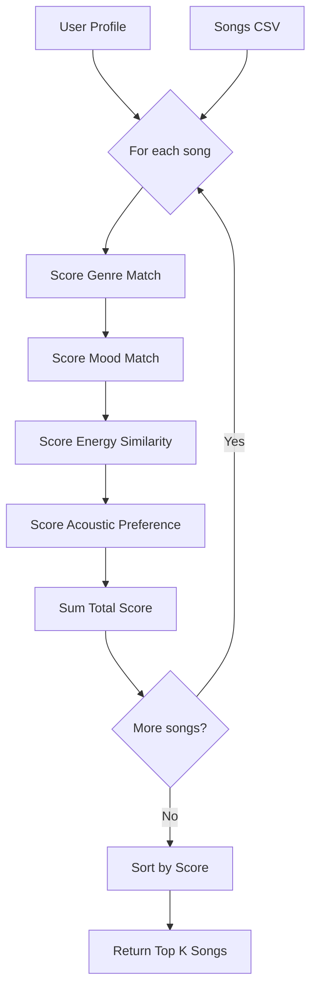
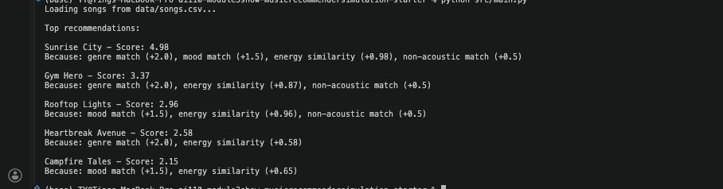
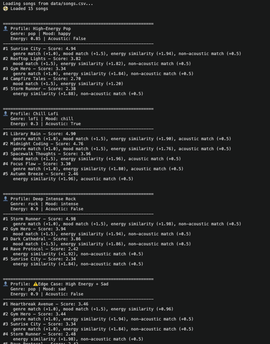

# 🎵 Music Recommender Simulation

## Project Summary

VibeFinder 1.0 is a content-based music recommender that scores songs based on how well they match a user's preferences for genre, mood, energy level, and acoustic style. It demonstrates how simple weighted scoring can produce convincing recommendations — and where such systems can go wrong.

---

## How The System Works

### Understanding Real-World Recommendations

Music streaming platforms like Spotify use two main approaches to suggest songs. **Collaborative filtering** analyzes what millions of users listen to and finds patterns — "users who liked Song A also liked Song B." **Content-based filtering** looks at the attributes of songs themselves — tempo, energy, mood, genre — and matches them to a user's stated preferences. Real platforms combine both approaches, but collaborative filtering requires massive amounts of user behavior data.

### What This Version Prioritizes

This simulation uses **content-based filtering** because we can build it with a small dataset and no user history. Our system calculates a compatibility score between a user's taste profile and each song's attributes, then ranks songs by that score.

The key insight: for numerical features like energy, we don't reward "higher is better" — we reward **closeness to the user's target**. A user who wants chill music (energy: 0.3) should get low-energy songs, not high-energy bangers.

### Data Structures

**Song** — each track in our catalog has:
- `id` — unique identifier
- `title`, `artist` — display info
- `genre` — categorical (pop, rock, lofi, electronic, etc.)
- `mood` — categorical (happy, sad, chill, energetic, intense)
- `energy` — 0.0 to 1.0, how intense/active the song feels
- `tempo_bpm` — beats per minute
- `valence` — 0.0 to 1.0, musical positivity
- `danceability` — 0.0 to 1.0, how suitable for dancing
- `acousticness` — 0.0 to 1.0, acoustic vs. electronic

**UserProfile** — a user's preferences:
- `favorite_genre` — the genre they prefer
- `favorite_mood` — the mood they're seeking
- `target_energy` — their ideal energy level (0.0–1.0)
- `likes_acoustic` — boolean preference for acoustic sounds

### Scoring Logic (Algorithm Recipe)

```
Score = (genre_match × 2.0) 
      + (mood_match × 1.5) 
      + (energy_similarity × 1.0) 
      + (acoustic_preference × 0.5)
```

Where:
- `genre_match` = 1 if song.genre == user.favorite_genre, else 0
- `mood_match` = 1 if song.mood == user.favorite_mood, else 0  
- `energy_similarity` = 1.0 - |song.energy - user.target_energy|
- `acoustic_preference` = 1 if preferences align, else 0

### Data Flow



### Potential Biases

- **Genre dominance**: With a weight of 2.0, genre matching may overshadow other good matches
- **Dataset imbalance**: If the catalog has more songs of one genre, some users get more variety than others
- **Binary acoustic preference**: Real listeners have gradual preferences, not just "likes" or "doesn't like"
- **Missing context**: The system ignores lyrics, language, tempo preference, and artist familiarity

---

## Getting Started

### Setup

1. Create a virtual environment (optional but recommended):

   ```bash
   python -m venv .venv
   source .venv/bin/activate      # Mac or Linux
   .venv\Scripts\activate         # Windows
   ```

2. Install dependencies

```bash
pip install -r requirements.txt
```

3. Run the app:

```bash
python src/main.py
```

### Running Tests

Run the starter tests with:

```bash
pytest
```

You can add more tests in `tests/test_recommender.py`.

---

## Experiments You Tried

### Default "pop/happy" Profile Results

Running the recommender with the starter profile (genre: pop, mood: happy, energy: 0.8, likes_acoustic: false):



**Top result:** Sunrise City scored 4.98 — a near-perfect match with genre (+2.0), mood (+1.5), energy similarity (+0.98), and non-acoustic preference (+0.5).

**Observations:**
- Genre match dominates: Gym Hero ranked #2 despite being "intense" mood because it matched the "pop" genre
- Rooftop Lights (#3) shows that mood match alone isn't enough to beat a genre match
- The scoring logic correctly prioritizes based on the weights I set

### Experiment 1: Increased Energy Weight

Changed weights: `GENRE_WEIGHT = 1.0` (was 2.0), `ENERGY_WEIGHT = 2.0` (was 1.0)



**Result:** The edge case (High Energy + Sad) became much closer — Heartbreak Avenue barely won by 0.02 points instead of 0.51. This shows that weight choices significantly impact recommendations.

---

## Limitations and Risks

- **Tiny catalog**: Only 15 songs means limited variety for any user profile
- **No lyric understanding**: The system can't tell if lyrics are sad even if the mood tag says "happy"
- **Genre over-prioritized**: A user wanting high-energy music still gets low-energy songs if the genre matches
- **Filter bubble**: Users never discover music outside their stated preferences
- **Western-centric data**: No K-pop, reggaeton, Bollywood, or non-English music represented

See [model_card.md](model_card.md) for deeper analysis.

---

## Reflection

Read and complete `model_card.md`:

[**Model Card**](model_card.md)

Building this recommender taught me that "AI recommendations" aren't mysterious — they're weighted comparisons. The most impactful decisions weren't about code, but about values: how much should genre matter versus energy? My choice to weight genre at 2.0 meant that a low-energy song in the right genre beats a perfect-energy song in the wrong genre. Real platforms like Spotify make these same tradeoffs, invisibly shaping what billions of people hear.

I also learned that bias can creep in from the data itself. My catalog had 3 lofi tracks but only 1 jazz track, so lofi fans get variety while jazz fans get repetition. This mirrors real-world concerns about recommendation systems favoring mainstream content over niche tastes.
